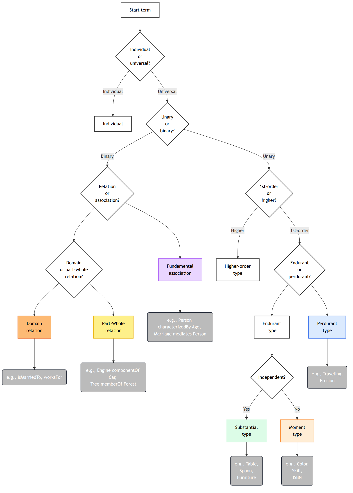

UFO Modeling Decision Tree
==========================
The UFO Modeling Decision Tree is step-by-step guide designed to help novice modelers navigate the Unified Foundational Ontology (UFO). This project provides a structured path to help you decide which UFO entity best represents a concept in your domain, using a series of intuitive questions.

## Project goals
The primary aim is to provide a clear overview of the different UFO entities, helping to get a "feel" for the framework without getting lost in formal logic. While the project was born from a learning journey, it has been refined to reflect the core pillars of UFO-A (Structural) and UFO-B (Events/Perdurants).

After you get a "feel", reading official UFO documentation should be more straightforward. It is recommended to do this, since the tree is a practical guide and not meant to be a replacement for the official documentation.

## Key Characteristics
To make modeling as efficient as possible, this decision tree follows a few design principles:

- Type-Individual Mirroring: There is a symmetry between the Universal (Type) tree and the Individual (Instance) tree. This ensures that the logic you use to define a category (e.g., "Person") is the same logic you use to classify a specific fact (e.g., "John").
- Referential Consistency: To reduce complexity, the Individual tree acts as a "mirror." For well-understood structures like Part-Whole relations, the Individual tree refers you back to the Type tree's laws rather than duplicating the entire sub-tree.
- Module Integration: The flow seamlessly bridges structural categories (UFO-A) with dynamic event mereology (UFO-B).
- Visual Guidance: Consistent color-coding helps you stay oriented:

    - Green: Substantial Types (Objects, Kinds)
    - Orange: Moment Types (Properties, Relators)
    - Blue: Perdurant Types (Events, Processes)
    - Purple: Fundamental Associations (Characterization, Mediation, etc.)
    - Yellow: Part-Whole Relations (ComponentOf, MemberOf, etc.)
    - Light gray: Abstract types
    - Darker gray: Individuals
    - White: Decision tree nodes
- Occurrence Terminology: "Occurrence" is used for non-intentional atomic events to create clearer distinction from Actions. UFO uses "Event" generically
- Situation: Includes situation individuals from recent UFO extensions, representing states of affairs that trigger or result from events.

## Getting Started
1. Start here: Open `00-Start.png` to classify your term as Individual or Universal
2. For Types: Follow the Universal branch through Substantial, Moment, or Perdurant trees
3. For Instances: Open `01-Individual.png` to navigate instance-level entities and relations
4. Examples provided: Each decision node includes concrete examples to guide you

## File Structure
- `00-Start.mermaid` - Top-level: Individual vs. Universal
- `01-Individual.mermaid` - Instance-level entities and relations
- `02-Substantial.mermaid` - Types: Kinds, Roles, Phases, Categories, etc.
- `03-Moment.mermaid` - Types: Qualities, Modes, Relators
- `04-Relational.mermaid` - Relations and fundamental associations
- `05-Perdurant.mermaid` - Types: Events, Actions, Processes, Activities

### Example: Modeling "John's Marriage to Mary"

As a Type (Universal):

- Individual or Universal? → Universal
- Unary or Binary? → Unary (Marriage is an entity)
- 1st-order or Higher? → 1st-order
- Endurant or Perdurant? → Endurant
- Independent? → No (depends on people involved)
- Intrinsic or Relator? → Relator (mediates relationship)

  → Result: Relator type

As an Instance (Individual):

- Individual or Universal? → Individual
- Unary or Binary? → Unary (this specific marriage)
- Endurant/Perdurant/Situation? → Endurant
- Substantial or Moment? → Moment

  → Result: Moment individual (specifically: a relator individual)

## Theoretical Liberties and streamlining
To keep the tree accessible for rapid modeling, some strategic "corner-cutting" was applied where a formal distinction might cause "decision fatigue" for beginners:

- Participation Placement: Placed in the Relational tree to emphasize its role as a link between objects and events.
- Mode/Disposition Grouping: Combined into a single node for a smoother entry point.
- Abstract Simplification: Using "Fixed value space" as a practical rule of thumb to distinguish between Datatypes and Enumerations.
- Domain Relation: Used as an umbrella term for both Formal and Material relations to match common modeling practice. These relations are about the domain that is modeled.

## Learn More
- [Official UFO Documentation](https://nemo.inf.ufes.br/projetos/ufo/)
- [OntoUML Documentation](https://ontouml.readthedocs.io/)
- [UFO 2022 Paper](https://philpapers.org/archive/PORUUF.pdf)

## Rendering
For rendering the mmdc mermaid cli tool is used. See render.sh for more information.

## Dependencies
The Mermaid CLI mmdc tool is required for rendering.

## Issues
Preferably the tree should be rendered as plain SVG and be openable in Inkscape. This is not working yet.

## Contributing
Contributions are welcome! Please submit a pull request with your changes.

